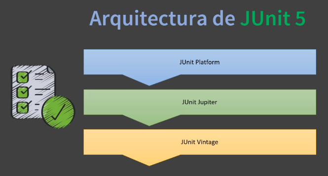
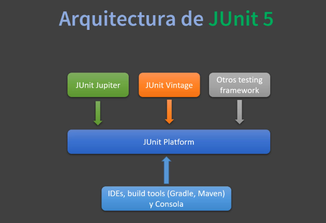
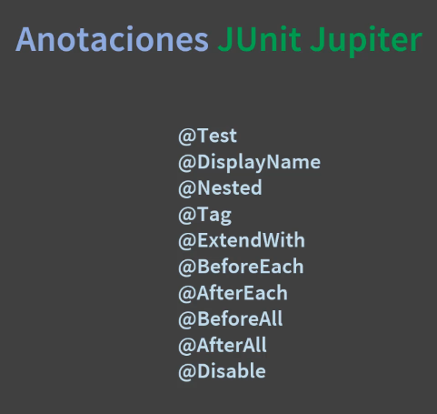

# Notas

Se empieza por el diseno al desarrollar una aplicacion que resuelva el problema, despues se escribe el codigo, testear el codigo.

Una prueba: tiene un input, pieza de codigo, output.

Se necesitan pruebas automatizadas y continuas, segun se realicen cambios en la aplicacion.

## Conceptos clave

**Que son las pruebas unitarias?** Procesos para verificar que el codigo cumple con las reglas de negocio, esto permite afirmar un resultado esperado.

**Que es JUnit?** Libreria de java para escribir y ejecutar repetibles pruebas unitarias y ejecutarlas en la JVM. Utiliza programacion funcional y lambda e incluye varios estilos de pruebas, configuraciones, anotaciones, ciclo de vida, etc.

## Introduccion a JUnit 5 

1. **JUnit Platform**:
   - Es la base sobre la cual se ejecutan los frameworks de pruebas. Proporciona un modelo de programación y una API para lanzar pruebas desde diferentes entornos, como IDEs o herramientas de línea de comandos.
   - Permite la ejecución de pruebas de diferentes frameworks, no solo de JUnit, gracias a su arquitectura extensible.
   - Incluye un lanzador de pruebas que puede descubrir y ejecutar pruebas en la JVM.

2. **JUnit Jupiter**:
   - Es la nueva generación de JUnit, que introduce un nuevo modelo de programación y extensión para escribir pruebas.
   - Proporciona anotaciones y métodos de prueba que son más flexibles y potentes que los de JUnit 4.
   - Soporta características modernas de Java, como expresiones lambda y programación funcional, lo que permite escribir pruebas más limpias y concisas.
   - API para escribir nuestros tests.
   - Anotaciones y estilos de testing.
   - Permite escribir extensiones.

3. **JUnit Vintage**:
   - Permite la ejecución de pruebas escritas con JUnit 3 y JUnit 4 en el entorno de JUnit 5.
   - Es útil para proyectos que tienen una base de código existente en versiones anteriores de JUnit y desean migrar gradualmente a JUnit 5 sin tener que reescribir todas las pruebas de inmediato.

Estos componentes trabajan juntos para ofrecer una plataforma de pruebas unificada y flexible que soporta tanto pruebas nuevas como existentes.

